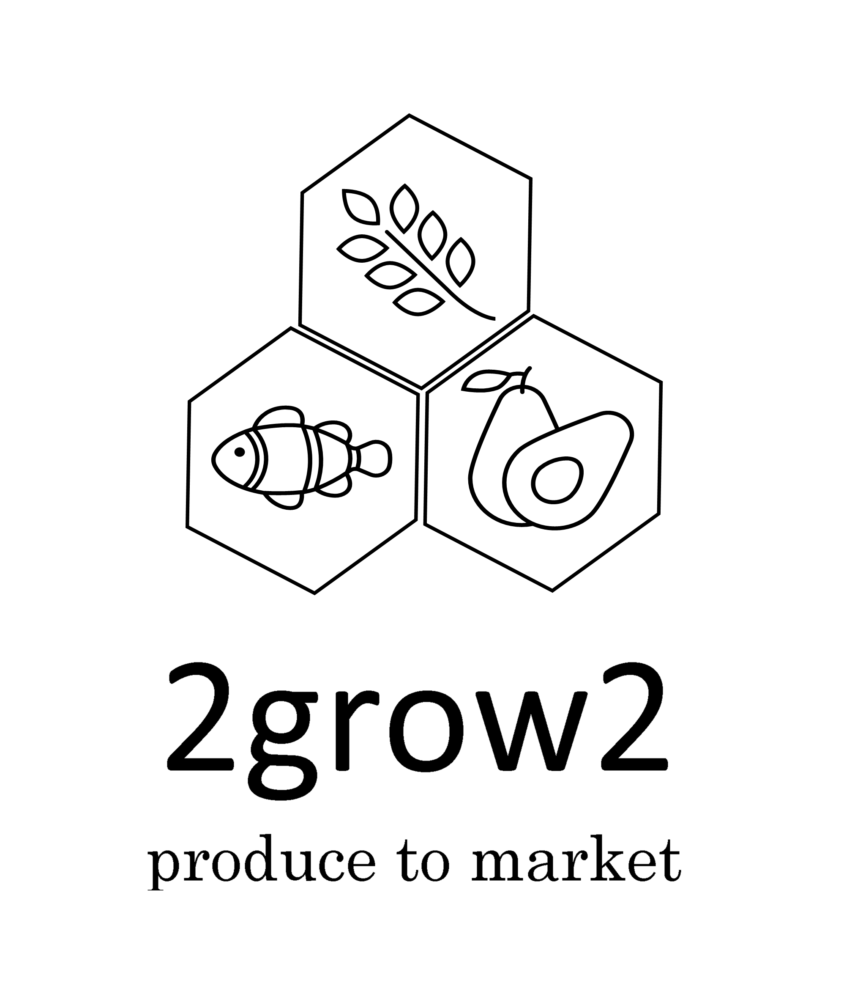

## About

### BuildforSDG Challenge 2020 - Team 262 Project - 2Grow2

This project originated as part of the BuildforSDG2020 Challenge with Andela and Facebook, which aims to give development experience to software developers in Africa.

Teams could select a problem statement to build a solution for from a list of approved problem statements listed under the Sustainable Development Goals.

These are our project logos:

Color: 

Black and white: 

White and black: 

## Why
Our team selected the SDG 2, Problem Statement 1.

## SDG PROBLEM STATEMENT SUMMARY

### Goal Summary

Goal 2 aims to end hunger and malnutrition by 2030, and to ensure access to safe, nutritious and sufficient food.
Our planet has provided us with tremendous resources, but unequal access and inefficient handling leaves millions of people malnourished. If we promote sustainable agriculture with modern technologiesand fair distribution systems, we
can help sustain the whole world’s population and help make sure that nobody will ever suffer from hunger again.

### Problem Statement 1
Build a solution that can help to double productivity for small scale food producers in your community.				This solution could be financial or allow them access opportunities, bigger markets etc.

### Project Overview
Help double the productivity and Income of Small Scale Food Producers
If your community can double the agricultural production and income of small-scale food producers, in particular women, family farmers, animal and fish farmers, by creating access to to land, technical knowledge, financial services, markets and opportunities then we can double the 	productivity and incomes of small-scale food producers.

#### 1.1 Idea Description
We can do a lot in alleviating poverty around our communities by employing cost-effective technology resources in a sustainable manner that will help double agricultural produce and correspondingly the incomes of small-scale farmers amongst our communities.

Let’s create a distributed farm produce aggregating network for local small scale farmers, including fish, animal and family run farming where our application will ‘funnel’ farm produce into categories and link these funnels to local supermarkets stores, food chain stores and restaurant chains. These food funnels will in turn boost demand from these large consumers since all best and fresh produce can be found in one platform. This directed demand from large customers will likely create incentives for smallscale farmers to produce more, and simultaneously boost incomes per unit of farmed land.

#### 1.2 How will the goal/aim be implemented
Local commercial customers (i.e. supermarkets stores, food chain stores and restaurant chains) prefer fresh produce but problem is that they prefer to buy in bulk, and since small-scale farmers do not have capacity to produce at large scale, we need a system that will create a linked network amongst neighboring small -scale farmers and pool them together in one platform. From here customers can find available farm produce, and then order these in ‘large scale’. In this platform customer s will not only find ready farm produce but can see what will be ready in near future and thus be able to place orders in advance. This model will ensure that not only customers get fresh produce but ensures that farmers always meet the demand efficiently (e.g. mismatched farm produce, managed food surplus, appropriate quality standards ) and therefore likely boost their cashflow and their incomes.

#### 1.3 Who are the market participants
Customers include supermarkets stores, food chain stores and restaurant chains.
Suppliers are your local farm produce, fish, and animal small-scale farmers.
Other involved parties will be transportation service providers and food aggregators/quality assurance providers.

#### 1.4 Solution structure

#### 1.5 Does this project idea solve the stated problem statement
Yes – This solution will assist small scale farmers to double both their produce and incomes by aggregating demand from commercial consumers and directing this to one pot. Agricultural produce is likely to be produced efficiently as consumers will be able to see what’s currently available on the market and what will be available in the near future and in what quantities

## Usage
 How would someone use what you have built, include URLs to the deployed app, service e.t.c when you have it setup

## Setup

## Hints

## Authors

### BuildforSDG Challenge 2020 - Team 262 Project - 2Grow2 - Team Members

| Picture | Team Role | Name | Country | City |Github|
|---------|-----------|------|---------|------|------|
||Andela Team Assistant|Jida|Country|City|Github|
||Team Mentor|Miami Larry|Kenya|City|miami78|
||Team Technical Lead|Sandile Magagula|South Africa|Johannesburg|Crazzyson|
||Team Member|Betsie Drost|South Africa|Pretoria|BetsieDrost|
||Team Member|Samukelo Jiyane|South Africa|Randburg|myjiyane|
||Team Member|Kamohelo Mohlabula|South Africa|Bloemfontein|kxmo-ai|
||Team Member|Phumlani Langa|South Africa|Soweto|Github|
||Team Member|Dibwe Kalangu|South Africa|Johannesburg|leanny01|
||Team Member|Bruce Kotsi|South Africa|Soweto|JR96|
||Team Member|Khumo Letlape|South Africa|Rustenburg|github|

## Contributing
If this project sounds interesting to you and you'd like to contribute, thank you!
First, you can send a mail to [buildforsdg@andela.com](mailto:buildforsdg@andela.com) to indicate your interest, why you'd like to support and what forms of support you can bring to the table, but here are areas we think we'd need the most help in this project :
1.  area one (e.g this app is about human trafficking and you need feedback on your roadmap and feature list from the private sector / NGOs)
2.  area two (e.g you want people to opt-in and try using your staging app at staging.project-name.com and report any bugs via a form)
3.  area three (e.g here is the zoom link to our end-of sprint webinar, join and provide feedback as a stakeholder if you can)

## Acknowledgements

Did you use someone else’s code?
Do you want to thank someone explicitly?
Did someone’s blog post spark off a wonderful idea or give you a solution to nagging problem?

It's powerful to always give credit.

## LICENSE
MIT
